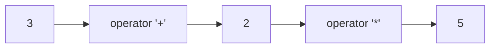
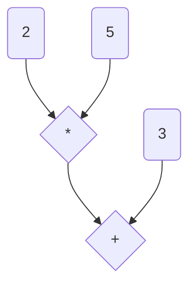

After playing around with the awesome ANTLR for a while (it is a [parser generator](https://www.antlr.org/), in case you are not familiar with it), I decided to write something that could have helped me before I started looking into parsers. This post assumes you have heard of parsers but never actually wrote one.

## A word (or two) on *what* parsers are
When you have a text with known syntax, be it structured logging, programming language or configuration files and you want to parse it with an application, you can use a parser that would transform text to objects in an application.  
Usually parsers have two components
- Lexer: transforms text into stream of known tokens, such as 'comma', 'variable identifier' or 'number'
- Parser: processes Lexer's tokens according to grammar rules and turns them into application objects (abstract syntax trees)

>Note: this is pretty much a description of a [GoF design pattern](https://en.wikipedia.org/wiki/Interpreter_pattern)

```mermaid
graph LR;
    A[Text]-->B[Lexer]
    B-->C[Parser]
    C-->D[Abstract Syntax Tree (AST)]

    style A fill:white,stroke:#333,stroke-width:1px
    style B fill:#e8e4da,stroke:#333,stroke-width:2px
    style C fill:#c2beb4,stroke:#333,stroke-width:2px
    style D fill:#b4dbba,stroke:#333,stroke-width:1px
```

This probably feels too abstract, so let me give a concrete example:  
Let's say we want to parse the following arithmetic expression: **3 + 2 * 5**
At first stage, we will pass this text through lexer. After lexing, we would have the following stream of tokens:

  
Then, the parser will traverse over the tokens and generate abstract syntax tree (AST), in our case, parsing would result with the following AST:

In order to evaluate such expression, we would use DFS to traverse the AST, first evaluating **2 * 5**, then evaluating **result + 3**. 
That's nice, but show me the code, perhaps? Ok!

## Hello ANTLR
The idea behind ANTLR is to create special syntax that would define tokens for the lexer and the grammar for the parser. In the code used here, for convenience I used a combined grammar that allows defining both tokens and grammar in one file. (Read more about ANTLR grammar structure [here](https://github.com/antlr/antlr4/blob/master/doc/grammars.md))  

### Lexer
First, we define the tokens for lexing. Here are their definitions:
``` antlr
//At the beginning of combined grammar file we need to declare the grammar name
//Note that the grammar name must be the same as grammar filename
grammar Algebra;

//start token definitions

//fragment is a kind of a function
fragment DIGIT: [0-9];

PLUS: '+';
MINUS: '-';
MULTIPLY: '*';
DIVIDE: '/';
POWER: '^';

LPAREN: '(';
RPAREN: ')';
COMMA: ',';

SIN: 'sin';
COS: 'cos';
TAN: 'tan';
LOG: 'log';

//token definition for integer number. Recognizes number of any length
//
//for this token, the idea is that the lexer would consume characters 
//from the input stream until they fit the 'DIGIT' fragment definition
INTEGER: DIGIT+;

//token definition for floating point number 
FLOAT: DIGIT+ '.' DIGIT+;
```

When ANTLR is called with the above lexer grammar, it would use the token definitions to generate a class, in this case ``AlgebraLexer``.
```cs
public partial class AlgebraLexer : Lexer {
  
  //define constants for tokens defined in the grammar
	public const int
		PLUS=1, MINUS=2, MULTIPLY=3, DIVIDE=4, POWER=5, LPAREN=6, RPAREN=7, COMMA=8, 
		SIN=9, COS=10, TAN=11, LOG=12, INTEGER=13, FLOAT=14;
```

And then, you'd see the following weirdness in the generated lexer:
```cs
public override string SerializedAtn { get { return _serializedATN; } }

	public static readonly string _serializedATN =
		"\x3\xAF6F\x8320\x479D\xB75C\x4880\x1605\x191C\xAB37\x2\x10S\b\x1\x4\x2"+
		"\t\x2\x4\x3\t\x3\x4\x4\t\x4\x4\x5\t\x5\x4\x6\t\x6\x4\a\t\a\x4\b\t\b\x4"+
		"\t\t\t\x4\n\t\n\x4\v\t\v\x4\f\t\f\x4\r\t\r\x4\xE\t\xE\x4\xF\t\xF\x4\x10"+
		"\t\x10\x3\x2\x3\x2\x3\x3\x3\x3\x3\x4\x3\x4\x3\x5\x3\x5\x3\x6\x3\x6\x3"+
		"\a\x3\a\x3\b\x3\b\x3\t\x3\t\x3\n\x3\n\x3\v\x3\v\x3\v\x3\v\x3\f\x3\f\x3"+
		"\f\x3\f\x3\r\x3\r\x3\r\x3\r\x3\xE\x3\xE\x3\xE\x3\xE\x3\xF\x6\xF\x45\n"+
		"\xF\r\xF\xE\xF\x46\x3\x10\x6\x10J\n\x10\r\x10\xE\x10K\x3\x10\x3\x10\x6"+
		"\x10P\n\x10\r\x10\xE\x10Q\x2\x2\x2\x11\x3\x2\x2\x5\x2\x3\a\x2\x4\t\x2"+
		"\x5\v\x2\x6\r\x2\a\xF\x2\b\x11\x2\t\x13\x2\n\x15\x2\v\x17\x2\f\x19\x2"+
		"\r\x1B\x2\xE\x1D\x2\xF\x1F\x2\x10\x3\x2\x3\x3\x2\x32;T\x2\x5\x3\x2\x2"+
		"\x2\x2\a\x3\x2\x2\x2\x2\t\x3\x2\x2\x2\x2\v\x3\x2\x2\x2\x2\r\x3\x2\x2\x2"+
		"\x2\xF\x3\x2\x2\x2\x2\x11\x3\x2\x2\x2\x2\x13\x3\x2\x2\x2\x2\x15\x3\x2"+
		"\x2\x2\x2\x17\x3\x2\x2\x2\x2\x19\x3\x2\x2\x2\x2\x1B\x3\x2\x2\x2\x2\x1D"+
		"\x3\x2\x2\x2\x2\x1F\x3\x2\x2\x2\x3!\x3\x2\x2\x2\x5#\x3\x2\x2\x2\a%\x3"+
		"\x2\x2\x2\t\'\x3\x2\x2\x2\v)\x3\x2\x2\x2\r+\x3\x2\x2\x2\xF-\x3\x2\x2\x2"+
		"\x11/\x3\x2\x2\x2\x13\x31\x3\x2\x2\x2\x15\x33\x3\x2\x2\x2\x17\x37\x3\x2"+
		"\x2\x2\x19;\x3\x2\x2\x2\x1B?\x3\x2\x2\x2\x1D\x44\x3\x2\x2\x2\x1FI\x3\x2"+
		"\x2\x2!\"\t\x2\x2\x2\"\x4\x3\x2\x2\x2#$\a-\x2\x2$\x6\x3\x2\x2\x2%&\a/"+
		"\x2\x2&\b\x3\x2\x2\x2\'(\a,\x2\x2(\n\x3\x2\x2\x2)*\a\x31\x2\x2*\f\x3\x2"+
		"\x2\x2+,\a`\x2\x2,\xE\x3\x2\x2\x2-.\a*\x2\x2.\x10\x3\x2\x2\x2/\x30\a+"+
		"\x2\x2\x30\x12\x3\x2\x2\x2\x31\x32\a.\x2\x2\x32\x14\x3\x2\x2\x2\x33\x34"+
		"\au\x2\x2\x34\x35\ak\x2\x2\x35\x36\ap\x2\x2\x36\x16\x3\x2\x2\x2\x37\x38"+
		"\a\x65\x2\x2\x38\x39\aq\x2\x2\x39:\au\x2\x2:\x18\x3\x2\x2\x2;<\av\x2\x2"+
		"<=\a\x63\x2\x2=>\ap\x2\x2>\x1A\x3\x2\x2\x2?@\an\x2\x2@\x41\aq\x2\x2\x41"+
		"\x42\ai\x2\x2\x42\x1C\x3\x2\x2\x2\x43\x45\x5\x3\x2\x2\x44\x43\x3\x2\x2"+
		"\x2\x45\x46\x3\x2\x2\x2\x46\x44\x3\x2\x2\x2\x46G\x3\x2\x2\x2G\x1E\x3\x2"+
		"\x2\x2HJ\x5\x3\x2\x2IH\x3\x2\x2\x2JK\x3\x2\x2\x2KI\x3\x2\x2\x2KL\x3\x2"+
		"\x2\x2LM\x3\x2\x2\x2MO\a\x30\x2\x2NP\x5\x3\x2\x2ON\x3\x2\x2\x2PQ\x3\x2"+
		"\x2\x2QO\x3\x2\x2\x2QR\x3\x2\x2\x2R \x3\x2\x2\x2\x6\x2\x46KQ\x2";

	public static readonly ATN _ATN =
		new ATNDeserializer().Deserialize(_serializedATN.ToCharArray());
```

*ATN* stands for *Augmented Transition Networks* - a state machine generated by ANTLR to parse tokens and grammar rules.
For example, this is the states generated to parse '+' operator:
<object data="PLUS.atn.svg" type="image/xml+svg">
	<!-- Your browser doesn't support rendering of SVG -->
	
</object>

Now, what if we have a more complex token? For example, how would lexer token definition look like for a C-style double quoted string?
```antlr
fragment D_STRING: '"' ( '\\'. | '""' | ~('"'| '\\') )*? '"';
```
The idea here is roughly similar to regex definition: we define starting and stopping character of the token (which are double quotes), then tell ANTLR to greedily parse any characters except ``"`` or ``\`` (this is done by using '*' that specifies 'greedy' parsing strategy)
This could be illustrated by what is sometimes called "railroad diagram":
<object data="D_STRING.rrd.svg" type="image/xml+svg">
	<!-- Your browser doesn't support rendering of SVG -->
	
</object>

As you can imagine, the ATN for such token is more... interesting.
<object data="D_STRING.atn.svg" type="image/xml+svg">
	<!-- Your browser doesn't support rendering of SVG -->
	
</object>

### Parser
After we defined tokens, let's define grammar rules by which the parser will do the generation.
```antlr
//parsing rules definitions
//root expression to parse, this is the starting point of the parser
root: expression EOF;

// This is a *recusive* rule to parse types of expressions we support.
// Conceptually, this is evaluated from top down: the parser tries to match the first one (which is NumberExpression).
// If it fails, the parser will try the next one. And so on..
expression:
   (INTEGER | FLOAT)                                                  #NumberExpression         |
   MINUS num = expression                                           #NegativeNumberExpression   |
   num = expression POWER pow = expression                             #PowerExpression         |
   LPAREN expression RPAREN                                         #ParenthesisExpression      |
   SIN LPAREN num = expression RPAREN                                  #SinusExpression         |
   COS LPAREN num = expression RPAREN                                #CosinusExpression         |
   TAN LPAREN num = expression RPAREN                                #TangentExpression         |
   LOG LPAREN num = expression COMMA base = expression RPAREN         #LogarithmExpression      |
   //notice that we put handling of multiplication and division first and then addition and substraction
   //this is needed to establish operator precedence 
   //In this way, for expression '2 + 3 * 5', first 3*5 will be evaluated and then 'result' + 2
   left = expression op = (MULTIPLY | DIVIDE) right = expression   #MultOrDivideExpression      |
   left = expression op = (PLUS | MINUS) right = expression        #PlusOrMinusExpression      
   ;
```

The same kind of ATN is generated for parsing grammar rules. For example, the defined above ``expression`` rule will have the following (huge!) ATN:
<object data="expression.atn.svg" type="image/xml+svg">
	<!-- Your browser doesn't support rendering of SVG -->
	
</object>

Now, lets take a look at the code ANTLR actually generates. I think this can be avery good illustration at what ATN *is*.
```cs
   private ExpressionContext expression(int _p) {
      // some initialization code
      EnterRecursionRule(_localctx, 2, RULE_expression, _p);
      int _la;
      try {
         int _alt;
         EnterOuterAlt(_localctx, 1);
         {
         State = 37;
         _errHandler.Sync(this);
		 //_input is a stream of tokens received from the lexer
		 //here we look ahead 1 character and decide what kind of sub-rule we want to TRY and parse
		 //notice that we do not *consume* characters (the Consume() method) until we are sure it is the right rule
         switch (_input.La(1)) {
		 //note: INTEGER and FLOAT are tokens defined in the lexer
         case INTEGER: 
         case FLOAT:
            {
			//notice that the context is the '#NumberExpression' we had in the rule definition
            _localctx = new NumberExpressionContext(_localctx);
            _ctx = _localctx;
            _prevctx = _localctx;

            State = 8; //set ATN state
            _la = _input.La(1);
            if ( !(_la==INTEGER || _la==FLOAT) ) {
            _errHandler.RecoverInline(this);
            } else {
               if (_input.La(1) == TokenConstants.Eof) {
                  matchedEOF = true;
               }

               _errHandler.ReportMatch(this);
               Consume(); //only here we actualy consume 
            }
            }
            break;
         case MINUS:
            {
			//notice that this matches '#NegativeNumberExpression' defined in the rule
            _localctx = new NegativeNumberExpressionContext(_localctx);
            _ctx = _localctx;
            _prevctx = _localctx;
			//set ATN state and try to match a token against current input symbol
            State = 9; Match(MINUS); 
            State = 10; ((NegativeNumberExpressionContext)_localctx).num = expression(9);
            }
            break;

 //more code for the rule...
```
That scary bunch of code looks a bit complex, but if you look closely it is rather simple (though still ugly!).
First, we enter the rule and set the state machine to the inital state of the particular rule
```cs
      EnterRecursionRule(_localctx, 2, RULE_expression, _p);
      int _la;
      try {
         int _alt;
         EnterOuterAlt(_localctx, 1);
         {
         State = 37; //initial state of the state machine
         _errHandler.Sync(this);
```

Then we use the next token in the stream to select the "sub-rule" we have at this particular point of the source code we are parsing
```cs
 switch (_input.La(1)) {
     //...
```

Then, if we have an INTEGER or a FLOAT token, we switch the current context to the "sub-rule" context, 
```cs
   case INTEGER: 
         case FLOAT:
            {
			//notice that the context is the '#NumberExpression' we had in the rule definition
            _localctx = new NumberExpressionContext(_localctx);
```

After switching the context, we cache the next character and "consume" the token from lexer stream (consuming means we mark the token as parsed, add it to resulting AST and continue)
```cs

            State = 8; //set ATN state for this "sub-rule"
            _la = _input.La(1); //cache the next token in lexer stream

            //do some error handling in case the syntax is wrong
            //note how we try to recover so despite syntax errors we parse ALL of the source code
            if ( !(_la==INTEGER || _la==FLOAT) ) {
            _errHandler.RecoverInline(this);
            } else {
               if (_input.La(1) == TokenConstants.Eof) {
                  matchedEOF = true;
               }

                //register match for the "sub-rule" --> this essentially adds node to AST
               _errHandler.ReportMatch(this);

               //mark the token as consumed and remove from lexer's token stream
               Consume();
            }
```
Well... thats it! Roughly, all rules are parsed in this way, the only thing that differs is how next rules for the state machine are predicted (ANTLR has different [prediction modes](https://www.antlr.org/api/Java/org/antlr/v4/runtime/atn/PredictionMode.html) that affect ambiguity resolution, among other things) and how errors are treated (see error handling strategy link below).  
  
Now, the nice thing in ANTLR generated parsers is their ability to continue parsing even if the input is partially incorrect. The method ``Parser::Match()`` (which is used in grammar rule parsing) illustrates this well. Notice how it registers the error, tries to recover and returns *bad token* so the parsing can continue.  
> This behavior can be changed by implementing different [error handling strategies](https://www.antlr.org/api/Java/org/antlr/v4/runtime/ANTLRErrorStrategy.html) but this is out of the scope of this post.
```cs
[return: NotNull]
public virtual IToken Match(int ttype)
{
    IToken badToken = this.CurrentToken;
    if (badToken.Type == ttype)
    {
    if (ttype == -1)
        this.matchedEOF = true;
    this._errHandler.ReportMatch(this);
    this.Consume();
    }
    else
    {
    badToken = this._errHandler.RecoverInline(this);
    if (this._buildParseTrees && badToken.TokenIndex == -1)
        this._ctx.AddErrorNode(badToken);
    }
    return badToken;
}
```

## Using the parser
Once we have a parsed our grammar and generated an AST, we need to evaluate it. Usually, this is done by using a [Visitor Pattern](https://en.wikipedia.org/wiki/Visitor_pattern) to walk over AST (in a DFS-y way) and evaluate it.  
In order to do that, ANTLR generates visitor classes, where each rule expression can be 'visited'. In our case, algebra expression evaluation would look this:
> Just in case you are not familiar with C# 8 syntax: in this sample I am using the new ``switch expressions`` syntax. You can read more about them [here](https://dotnetcoretutorials.com/2019/06/25/switch-expressions-in-c-8/).
```cs
public class ExpressionEvaluationVisitor : AlgebraBaseVisitor<double>
{
    public override double VisitPowerExpression(AlgebraParser.PowerExpressionContext context) => 
        Math.Pow(base.Visit(context.num), (int)base.Visit(context.pow));

    public override double VisitNumberExpression(AlgebraParser.NumberExpressionContext context) => 
        double.Parse(context.GetText(), NumberStyles.Any);

    public override double VisitMultOrDivideExpression(AlgebraParser.MultOrDivideExpressionContext context) =>
        context.op.Text switch
        {
            "*" => (base.Visit(context.left) * base.Visit(context.right)),
            "/" => (base.Visit(context.left) / base.Visit(context.right)),
            _ => throw new ArgumentException($"Unsupported operator '{context.op.Text}'")
        };

    public override double VisitPlusOrMinusExpression(AlgebraParser.PlusOrMinusExpressionContext context) =>
        context.op.Text switch
        {
            "+" => (base.Visit(context.left) + base.Visit(context.right)),
            "-" => (base.Visit(context.left) - base.Visit(context.right)),
            _ => throw new ArgumentException($"Unsupported operator '{context.op.Text}'")
        };

    public override double VisitCosinusExpression(AlgebraParser.CosinusExpressionContext context) => 
        Math.Cos(base.Visit(context.num));

    public override double VisitLogarithmExpression(AlgebraParser.LogarithmExpressionContext context) => 
        Math.Log(base.Visit(context.num), base.Visit(context.@base));

    public override double VisitTangentExpression(AlgebraParser.TangentExpressionContext context) => 
        Math.Tan(base.Visit(context.num));

    public override double VisitSinusExpression(AlgebraParser.SinusExpressionContext context) => 
        Math.Sin(base.Visit(context.num));

    public override double VisitNegativeNumberExpression(AlgebraParser.NegativeNumberExpressionContext context) => 
        -1 * base.Visit(context.num);


    protected override double AggregateResult(double aggregate, double nextResult) => 
        aggregate + nextResult;
}
```

## Conclusion
As you can see, writing parsers might seem daunting at first, but in reality it is not a very hard task. Of course there is a notion of user-friendly error handling, ensuring proper ambiguity resolution and other stuff, but I think for a "hello world" tutorial the above code should be enough.
You can take a look at the whole sample project here: [https://github.com/myarichuk/AlgebraExpressionEvaluator](https://github.com/myarichuk/AlgebraExpressionEvaluator). In case you'd like to compile and run it, note that it targets .Net Core 3.0