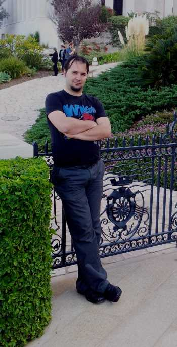

Hi, my name is Michael. I am a software developer by day, and a passionate tinkerer by night, spending good portion of my free time on various pet projects, exploring new technologies, testing out ideas and having fun while doing it :)
The results of my tinkering you can find in my [GitHub repository](https://github.com/myarichuk). No technology or idea is out-of-scope for my tinkering - the more complex the topic, the better!

So, what is “Graymatter Developer” you may wonder...
Scott Hanselman in his blog post - Dark Matter Developers: The Unseen 99%, coined a term that could be used to describe me - a “dark matter developer”.

I was a good fit for the description - didn’t have a blog, nor a podcast and did not have or participated in any open-source projects or even spoke publicly. This is changing now, and from a "dark matter developer" I have turned into a "gray matter developer" - still not fully in the light, but getting there. Recently, I have opened a blog and I try to speak at conferences as often as possible, partly because I enjoy it and partly because I hope to benefit other developers with stuff I talk about. 
By the way, if you have feedback about any of my talks at conferences or any of my pet projects, especially those I actively work on, I'd be happy to hear it!
